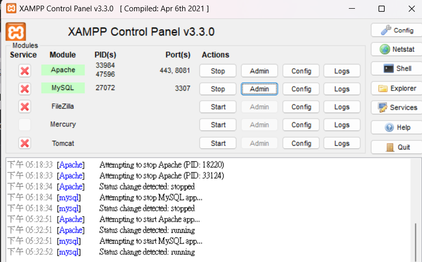
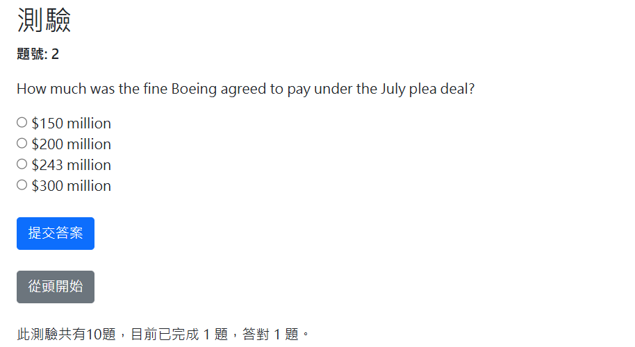

# 高等資料庫期末作業

header是網頁的上面菜單，可以直接改header檔

### 新增資料庫的題目檔案

utf8mb4_0900_ai_ci是地端workbench匯出檔
但因為XAMPP的phpmyadmin比較舊版本不支援**utf8mb4_0900_ai_ci** unicode

```
//刪掉COLLATE=utf8mb4_0900_ai_ci

```

才能匯入到mariadb

### 12/20更新
XAMPP的端口可以更改phpadmin跟workbench共存




<h3>12/26 更新</h3>
<h4>增加了顯示作答題數與分數</h4>



```php=
//設定session變數
//isset->判斷變數是否存在，如果有設置變數，即使是空值也會返回true
if (!isset($_SESSION['correct_sum'])) {
    $_SESSION['correct_sum'] = 0;
}

//然後再把session的值回存給變數，下面答對後對session進行++
//之後每次都會把新的值賦予到變數之中
$correct_sum = $_SESSION['correct_sum'];
$score = $correct_sum * 10;


```
#### 按鈕的修正
<button type="submit" name="action" value="submit" class="btn btn-primary">提交答案</button>
<button type="submit" name="action" value="next" class="btn btn-dark">下一題</button>

原本沒有對按鈕進行區別導致post的時候會多算題數 **(因為我原本只有判斷有沒有回傳答案而已)**

value是代表這個按鈕的值

name則是類似像他的類別

所以可以進行判斷

運算子合併的寫法
https://www.php.net/manual/zh/language.operators.comparison.php


```php=
//詳細語法如上方的網站
//如果$_POST['action']存在，就把value賦予給$action

$action=$_POST['action'] ?? null;

//所以當用戶按下按鈕，不同按鈕會回傳不同的值，就可以用值去判斷是哪個按鈕，在判斷式裡面進行不同的反應
if ($action === 'submit') {
    // 處理答案提交
    $correct_answer = $question['correct_answer'];
    if ($user_answer === $correct_answer) {
        $_SESSION['correct_sum']++;
        $feedback = "<p>恭喜答對！</p>";
    } else {
        $feedback = "<p>不正確，這題答案是: $correct_answer</p>";
    }
} elseif ($action === 'next') {
    // 處理下一題
    $_SESSION['current_question_index']++;
    header("Location: " . $_SERVER['PHP_SELF']);
    exit;
} elseif ($action === 'restart') {
    // 處理重新開始
    session_unset();
    session_destroy();
    header("Location: test_start.php");
    exit;
}

<button type="submit" name="action" value="submit" class="btn btn-primary">提交答案</button>
<button type="submit" name="action" value="next" class="btn btn-dark">下一題</button>

```


### 額外補充
VS.code可以ctrl+shift+V預覽markdown檔